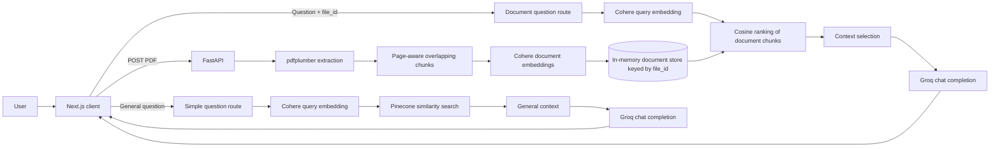

# EcoBot

<p align="center">
  
</p>

EcoBot is a document-grounded sustainability assistant for exploring ESG reports and other environmental documents. It combines PDF extraction, page-aware semantic retrieval, Cohere embeddings, Pinecone-backed sustainability context, and a Groq-hosted LLM behind a FastAPI API and Next.js interface.

The practical problem is familiar: sustainability information is distributed across long reports, while analysts need answers tied to the evidence in front of them. EcoBot gives users two explicit modes: general sustainability questions and questions grounded in an uploaded PDF.

## Key Features

- Upload a text-based PDF and receive a document identifier.
- Extract text with `pdfplumber`& `OCR`, preserving page boundaries for citations in the model context.
- Split each page into bounded, overlapping chunks and embed them with Cohere `embed-english-light-v3.0`.
- Rank uploaded-document chunks with cosine similarity against a query embedding.
- Retrieve general sustainability context from an existing Pinecone index.
- Use low-temperature generation and an explicit evidence-only instruction for document questions.
- Retain a short in-memory conversation history for general questions.
- Automatically expire uploaded document state after ten minutes.
- Serve the API with FastAPI and the web client with Next.js.

## Architecture



## RAG Workflow

### Document ingestion

`POST /upload-pdf` reads the uploaded bytes, enforces a 10 MB limit, checks the content type, extracts text, and creates a random `file_id`. The PDF is processed twice: once for the full text used by the prompt and once for page-aware retrieval chunks. Chunk embeddings are computed at upload time, so a question does not re-embed the document.

Uploaded state is held in process memory and expires after ten minutes. This is appropriate for a small single-instance demonstration, but it is not durable storage or a multi-worker document service.

### Chunking strategy

Each page is normalized independently and divided into chunks of approximately 1,200 characters with a 200-character overlap. The splitter prefers a whitespace boundary near the target size and stores the source page number alongside each chunk. This balances local ESG context with a bounded prompt footprint.

### Embeddings and vector stores

The Cohere embedding model uses separate modes required by the provider: `search_document` for uploaded chunks and `search_query` for user questions. Uploaded vectors are kept with their chunks in memory and ranked locally. General sustainability questions use the existing Pinecone index named `ragsustainability` through LangChain's Pinecone integration.

The paths are intentionally separate: an uploaded report must not accidentally retrieve content from another report or from a shared corpus.

### Retrieval and context selection

Document retrieval computes cosine similarity between the query vector and each chunk vector, then selects the five highest-ranked chunks. Selected context includes page labels and is capped per chunk before it is added to the prompt. General questions request four Pinecone matches; document questions use the uploaded document's ranked chunks.

This is semantic retrieval, not keyword search. There is currently no hybrid BM25 search, metadata filter, query rewrite, multi-query expansion, cross-encoder reranker, or maximal marginal relevance step. Those are useful next improvements, but are not claimed as existing capabilities.

### Query processing and generation

The API currently passes the original user question directly to retrieval. Document prompts specialize the response for ESG, carbon/footprint, SDG, or general document analysis based on simple keyword routing. Groq is called through its OpenAI-compatible chat completion endpoint using `meta-llama/llama-4-scout-17b-16e-instruct`.

Document generation uses temperature `0.2` and instructs the model to answer only from the business profile and retrieved context. If evidence is insufficient, the intended response is: `There is not enough information present in the uploaded PDF to answer this.` General questions use a higher temperature and a short in-memory history.

## Hallucination Mitigation

- Retrieval is document-scoped through the explicit `file_id` returned by upload.
- The document prompt separates the extracted profile from retrieved context.
- The model is explicitly prohibited from using outside company facts for document questions.
- Document generation uses a low temperature.
- Context is bounded instead of placing an entire long report into every request.

These are prompt- and retrieval-level controls, not a factuality guarantee. The application does not yet verify claims against source spans, return structured citations, or run an answer faithfulness grader.

## Evaluation and Metrics

There is a committed evaluation dataset, automated RAG evaluation suite, tracing integration & benchmark in the repository. A production evaluation plan consists of measuring Recall@k and nDCG for page-level evidence retrieval, context precision and recall, answer faithfulness and relevance, abstention accuracy, provider latency, token usage, and failure rates.


## Tech Stack

- **API:** Python, FastAPI, Uvicorn
- **PDF extraction:** pdfplumber
- **Embeddings:** Cohere `embed-english-light-v3.0`
- **General vector retrieval:** Pinecone via `langchain_pinecone`
- **Generation:** Groq OpenAI-compatible chat completions
- **Web client:** Next.js 16, React 19, TypeScript, Tailwind CSS 4, lucide-react
- **Deployment:** Azure Web App workflow for the Python service and Vercel-compatible API routing configuration

## Project Structure

```text
EcoBot/
├── api/
│   ├── index.py                 # FastAPI routes and upload lifecycle
│   └── main.py                  # extraction, chunking, embeddings, retrieval, prompts
├── frontend/
│   ├── app/page.tsx             # upload and chat UI
│   ├── app/layout.tsx           # Next.js metadata and root layout
│   ├── app/globals.css          # Tailwind theme and base styles
│   ├── package.json
│   └── Dockerfile.dev
├── .github/workflows/           # Azure deployment workflow
├── requirements.txt
├── .env.example
└── vercel.json
```

## Installation

```bash
git clone https://github.com/MUnssRahim/EcoBot.git
cd EcoBot
python -m venv .venv
source .venv/bin/activate
pip install -r requirements.txt
cd frontend
npm install
```

## Environment Variables

Copy `.env.example` to `.env` for the backend:

```env
GROQ_API_KEY=your_groq_api_key
PINECONE_API_KEY=your_pinecone_api_key
COHERE_API_KEY=your_cohere_api_key
```

For the Next.js build, set `NEXT_PUBLIC_API_URL` to the reachable FastAPI base URL:

```env
NEXT_PUBLIC_API_URL=http://localhost:8000
```

The Pinecone index must already exist as `ragsustainability` and be compatible with the Cohere embedding dimension. The repository does not contain a corpus ingestion command for populating that general index.

## Running Locally

From the repository root:

```bash
python -m uvicorn api.index:app --reload --port 8000
```

In a second terminal:

```bash
cd frontend
npm run dev
```

Open `http://localhost:3000`. The frontend defaults to `http://localhost:8000` when `NEXT_PUBLIC_API_URL` is not set.

## API Examples

```bash
curl -F "file=@report.pdf" http://localhost:8000/upload-pdf
```

Use the returned `file_id` for document questions:

```bash
curl -X POST http://localhost:8000/ask-question \
  -F "file_id=UPLOAD_RESPONSE_FILE_ID" \
  -F "question=What Scope 1 emissions are reported?"
```

Ask a general sustainability question:

```bash
curl -X POST http://localhost:8000/ask-simple \
  -F "question=What are practical ways to reduce office energy use?"
```


## Future Improvements

1. Add a durable ingestion pipeline with document status, retries, and idempotent upserts.
2. Store tenant, document, page, section, and content-type metadata and filter every query.
3. Add hybrid dense plus lexical retrieval, followed by a cross-encoder or Cohere reranker.
4. Rewrite follow-up questions into standalone retrieval queries while preserving the original wording for generation.
5. Add citation-bearing answers, abstention tests, golden queries, and regression evaluation in CI.
6. Add async provider clients, request timeouts, structured logs, tracing, and operational health endpoints.

## License

The repository does not currently declare an open-source license. Treat it as internal or learning software unless the owner states otherwise.
